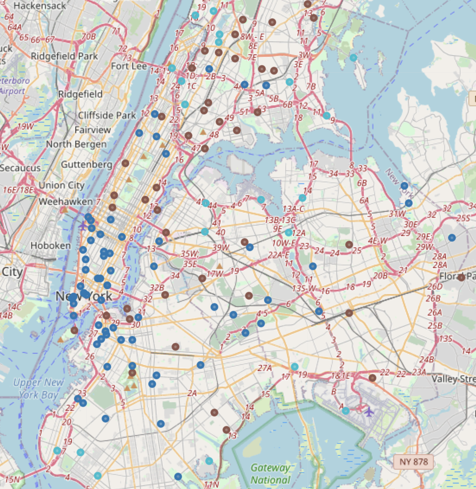

# Food Scarcity in New York City

Food scarcity is a well-known problem in New York City. It refers to the fact that some areas lack healthy food options that are usually provided by supermarkets or fresh food stores. These "food deserts", which they are colloquially called, often lead to higher rates of obesity and obesity related illnesses. 

The goal of this project was to use data collected from Foursquare to find areas that had similarities in terms of the amount of healthy food options they offered. 

### Data
The first source of data was from the various Wikipedia pages that held New York City's data. New York is unique in that while it is a single city, each borough is it's own county. This is the reason behind each borough having it's own webpage and webscraping code. 

The second source was from the FourSquare API that provided us the different venues in each of the locales. The combination of the two would eventually be what we use to cluster the neighborhoods. 

### Methodology
1. Using the Wikipedia pages, we webscrape the name of each neighborhood in each of the five boroughs. 
2. Using Geopy, we give each neighborhood a Latitude and Longitude value. 
3. Next comes the use of the Foursquare API, we use it to find the venues and their categories within a radius of the coordinates. 
4. Remove all venues that were not part of the group that we decided were necessary for the clustering. Venues that were deemed relevant for this project are in categories including:
    * Fast Food Restaurants
    * Supermarkets
    * Grocery Store
5. All venue entries that were not categorized as the above were removed from the dataframe. From there an average was found for each neighborhood. This means that the percentage of fast food stores in the total for food places was found. This applies to all of the options listed above. 
6. Principal Component Analysis was done next in order to determine the amount of variance each of the features explained. The results were used in KMeans clustering. 
7. Looping though the possible number of clusters, the number was narrowed down by looking at the Silhouette Score and the Elbow Curve.
8. Mapping the results included using Folium.
9. Clusters were also visualized on Tableau. 

### Results
The results of the clustering model told an interesting story. Firstly, after we ran several iterations and concluded the best centroid numbers we found the silhouette scores based on those centroids. 

For those that are not sure about silhouette scores, I will include this link. It gives a general idea as to what a silhouette score is and why it's important for clustering. 

The final clustering model that scored second highest was the 3 centroid model. While the 4 centroid model scored higher, it actually captured a lot of noise so I went with the 3 centroid model.

The model broke up the clusters based on their supermarket and fast food restaurant scores. The most interesting part of clustering models is that they are unsupervised. This means that any information given by the model must be interpreted by the user.

The clusters broke down as such:
  * Cluster 1 - supermarkets are more often available.
  * Cluster 2 - supermarkets and fast-food restaurants are equally numerous.
  * Cluster 3 - fast-food restaurants are more numerous.
  
### Conclusions
Clustering is one of my favorite unsupervised techniques because it allows for outside knowledge in order to analyze the results. 

Based on the knowledge I bring to the project about New York City I can make several conclusions on the clustering locations. 

1. Most of the commercial districts seem to have higher percentages of fast-food restaurants. This is obvious, both by their placement in the downtown areas of New York City and by the idea that tourists/commuters would rather have access to faster food than supermarkets. These areas also number the most in the city.
2. Supermarkets are in a surplus in the more residential areas. Even when you give that caveat, the areas with the highest ratio of supermarkets are in higher-income areas like Riverdale in the Bronx - or are away from high traffic areas that serve tourists/commuters to and from work. These clusters number the least.
3. The last cluster is where the percentages are about even. This cluster has a mixture of both other clusters. They are more residential but are still considered high traffic areas for commuters/tourists. 

The end of the project brought many questions and many ideas as to what to do next. Combining the information gleaned with this data with census information in order to obtain income and demographic information would be a worthwhile path moving forward.

### Further Work
More time can be spent on the correlation between the clusters found here and median income for the city. That would involve transforming the coordinate data into zip codes or census tract data. Another route is to use census data to determine if there is any correlation between demographics and the clusters determined by the model.